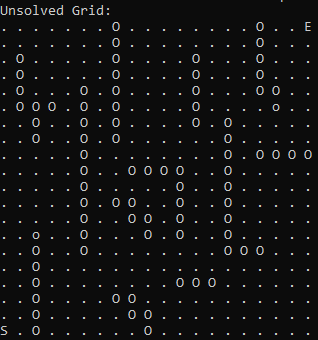
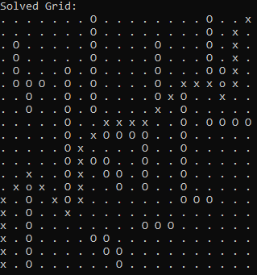

# A-Star-Pathfinding-in-Python

 An implementation of A* pathfinding in Python.

## Example

"S" represents the starting location

"E" represents the final location

"O" represents an obstacle that cannot be walked over

"o" represents an obstacle that can be walked over, but adds a cost to the tile

"." represents an empty tile

"x" represents part of the path

#### Unsolved Grid

#### Solved Grid

